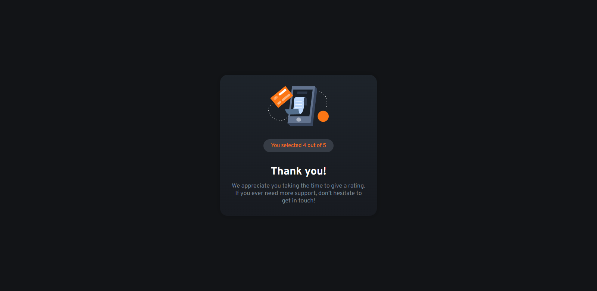

# Frontend Mentor - Interactive rating component solution

This is a solution to the [Interactive rating component challenge on Frontend Mentor](https://www.frontendmentor.io/challenges/interactive-rating-component-koxpeBUmI). Frontend Mentor challenges help you improve your coding skills by building realistic projects. 

## Table of contents

- [Overview](#overview)
  - [The challenge](#the-challenge)
  - [Screenshot](#screenshot)
  - [Links](#links)
- [My process](#my-process)
  - [Built with](#built-with)
- [Author](#author)

## Overview

### The challenge

Users should be able to:

- View the optimal layout for the app depending on their device's screen size
- See hover states for all interactive elements on the page
- Select and submit a number rating
- See the "Thank you" card state after submitting a rating

### Screenshot
- Form Rating

- Thank you card

### Links

- Solution URL: [Here](https://6488d9b912e09b26c0d5567f--moonlit-salmiakki-87695f.netlify.app/)

## My process

### Built with

- Semantic HTML5 markup
- CSS custom properties
- Flexbox
- CSS Grid
- Mobile-first workflow
- [React](https://reactjs.org/) - JS library

## Author

- Website - [David Maquen Vidaurre](https://david-vidaurre-portafolio.netlify.app/)
- Frontend Mentor - [@DavidVidaurre](https://www.frontendmentor.io/profile/DavidVidaurre)
- LinkedIn - [David Maquen Vidaurre](https://www.linkedin.com/in/luis-david-junior-maquen-vidaurre-b91986217/)

