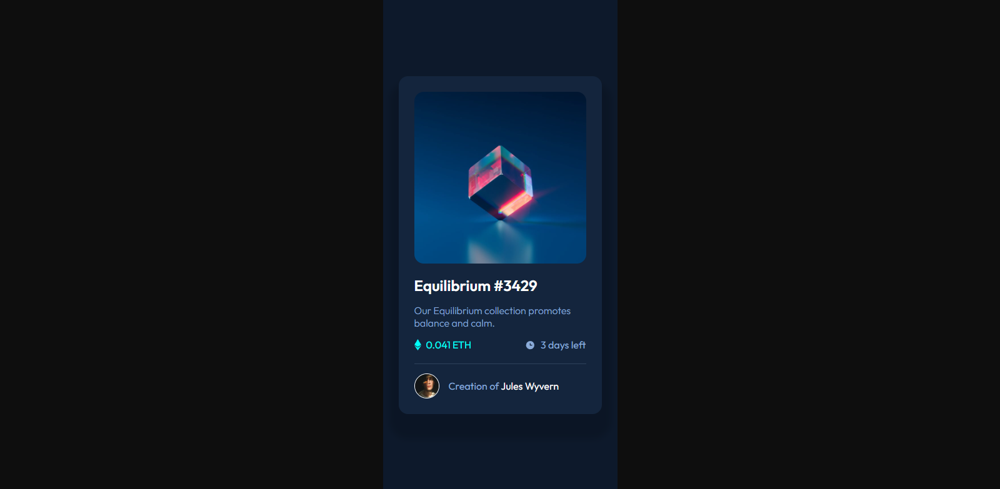

# Frontend Mentor - NFT preview card component solution

This is a solution to the [NFT preview card component challenge on Frontend Mentor](https://www.frontendmentor.io/challenges/nft-preview-card-component-SbdUL_w0U). Frontend Mentor challenges help you improve your coding skills by building realistic projects. 

## Table of contents

- [Overview](#overview)
  - [The challenge](#the-challenge)
  - [Screenshot](#screenshot)
  - [Links](#links)
- [My process](#my-process)
  - [Built with](#built-with)
- [Author](#author)

## Overview

### The challenge

Users should be able to:

- View the optimal layout depending on their device's screen size
- See hover states for interactive elements

### Screenshot

### Links

- Solution URL: [Here](https://648936543b80f45686a59aa9--kaleidoscopic-duckanoo-6d6e50.netlify.app/)

## My process

### Built with

- Semantic HTML5 markup
- CSS custom properties
- Flexbox
- CSS Grid
- Mobile-first workflow

## Author

- Website - [David Maquen Vidaurre](https://david-vidaurre-portafolio.netlify.app/)
- Frontend Mentor - [@DavidVidaurre](https://www.frontendmentor.io/profile/DavidVidaurre)
- LinkedIn - [David Maquen Vidaurre](https://www.linkedin.com/in/luis-david-junior-maquen-vidaurre-b91986217/)
